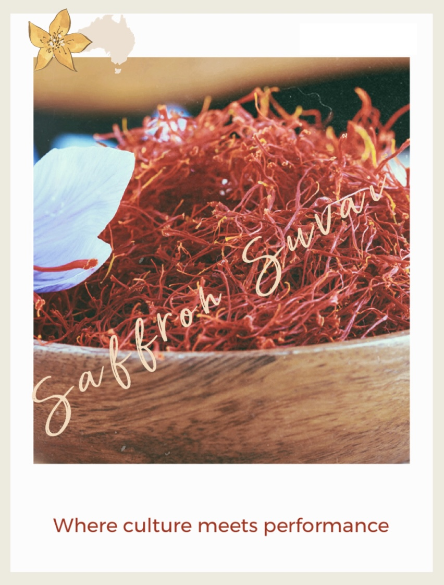

# Saffron Suvai - Indian Nutrition App

A personalized nutrition companion featuring Indian recipes, nutrition surveys, and AI-powered feedback. Built with React, TypeScript, and Supabase, with a beautiful Indian-themed design.



## ✨ Features

### 🔐 Authentication
- **Google OAuth** integration via Supabase Auth
- Automatic user profile creation
- Secure session management with Row Level Security (RLS)

### 📊 Nutrition Survey
- **9-question comprehensive survey** covering:
  - Age, weight, height
  - Activity level
  - Dietary restrictions and preferences
  - Health goals
  - Meal frequency and water intake
  - Food allergies
- Multi-step wizard with progress tracking
- Real-time validation
- Beautiful Indian-themed UI

### 💡 Personalized Feedback
- **BMR (Basal Metabolic Rate)** calculation using Mifflin-St Jeor equation
- **TDEE (Total Daily Energy Expenditure)** based on activity level
- **Target calorie recommendations** aligned with health goals
- **Macro distribution** (protein, carbs, fat) with visual charts
- **Prioritized recommendations** based on survey responses
- Automatic feedback generation and storage

### 🥗 Indian Recipe Cookbook
- **14 authentic Indian recipes** with complete nutrition data
- Categories: Breakfast, Lunch, Dinner
- **Advanced filtering**:
  - Search by recipe name or ingredients
  - Filter by category
  - Filter by dietary tags (vegetarian, vegan, high-protein, etc.)
- **Detailed recipe view** with:
  - Complete nutrition facts
  - Ingredients list
  - Step-by-step instructions
  - Prep and cook times
  - Source links

### 🎨 Indian-Themed Design
- Warm saffron, orange, and cream color palette
- Traditional Indian design patterns
- Responsive layout for all devices
- Smooth animations and transitions

## 🚀 Quick Start

### Prerequisites

- Node.js 18+ installed
- Supabase account ([supabase.com](https://supabase.com))
- Google Cloud project for OAuth

### Installation

1. **Clone the repository**:
```bash
git clone <your-repo-url>
cd Nutrition
```

2. **Install dependencies**:
```bash
npm install
```

3. **Set up environment variables**:

Create a `.env.local` file in the root directory:

```env
VITE_SUPABASE_URL=your_supabase_project_url
VITE_SUPABASE_ANON_KEY=your_supabase_anon_key
```

4. **Set up Supabase**:

Run the SQL migrations in your Supabase SQL Editor:
- `supabase/migrations/001_initial_schema.sql` - Creates tables and RLS policies
- `supabase/migrations/002_seed_recipes.sql` - Imports 14 recipes

5. **Configure Google OAuth in Supabase**:
   - Go to Supabase Dashboard → Authentication → Providers
   - Enable Google provider
   - Add your Google Client ID and Secret
   - Add authorized redirect URL: `http://localhost:5173/auth/callback` (for development)

6. **Start the development server**:
```bash
npm run dev
```

7. Open [http://localhost:5173](http://localhost:5173) in your browser

## 📁 Project Structure

```
Nutrition/
├── src/
│   ├── components/
│   │   ├── auth/
│   │   │   └── ProtectedRoute.tsx      # Route protection wrapper
│   │   ├── cookbook/
│   │   │   ├── RecipeCard.tsx          # Recipe card component
│   │   │   ├── RecipeDetail.tsx        # Recipe detail modal
│   │   │   ├── RecipeFilters.tsx       # Filter controls
│   │   │   └── RecipeList.tsx          # Main cookbook page
│   │   ├── feedback/
│   │   │   ├── FeedbackDisplay.tsx     # Feedback dashboard
│   │   │   └── MacroChart.tsx          # Macro distribution chart
│   │   ├── layout/
│   │   │   ├── Header.tsx              # Navigation header
│   │   │   └── Layout.tsx              # Page layout wrapper
│   │   └── survey/
│   │       ├── ProgressBar.tsx         # Survey progress indicator
│   │       ├── SurveyForm.tsx          # Main survey component
│   │       └── SurveyQuestion.tsx      # Individual question component
│   ├── hooks/
│   │   └── useAuth.ts                  # Authentication hook
│   ├── lib/
│   │   └── supabase.ts                 # Supabase client
│   ├── pages/
│   │   └── AuthCallback.tsx            # OAuth callback handler
│   ├── types/
│   │   ├── recipe.ts                   # Recipe type definitions
│   │   └── survey.ts                   # Survey type definitions
│   ├── utils/
│   │   └── nutritionCalculations.ts    # BMR/TDEE/Feedback logic
│   ├── App.tsx                         # Main app with routing
│   ├── main.tsx                        # App entry point
│   └── index.css                       # Global styles + Indian theme
├── supabase/
│   └── migrations/
│       ├── 001_initial_schema.sql      # Database schema
│       └── 002_seed_recipes.sql        # Recipe data
├── assets/
│   ├── recipes.json                    # Recipe data (JSON)
│   └── implementation_plan.md          # Development plan
└── public/
    └── images/
        └── logo.jpg                    # App logo
```

## 🗄️ Database Schema

### Tables

- **users** - User profiles linked to Supabase Auth
- **surveys** - User survey responses
- **feedback** - Generated nutrition feedback
- **recipes** - Indian recipe collection

All tables have Row Level Security (RLS) policies to ensure data privacy.

## 🎯 User Flow

1. **Landing Page** → User sees welcome page with app features
2. **Login** → User authenticates with Google OAuth
3. **Auth Callback** → User profile created, redirected based on survey status
4. **Survey** (first-time users) → Complete 9-question nutrition survey
5. **Dashboard** → View personalized nutrition plan with:
   - BMR, TDEE, and target calories
   - Macro distribution chart
   - Prioritized recommendations
6. **Cookbook** → Browse and filter 14 Indian recipes
7. **Recipe Detail** → View complete recipe with nutrition info

## 🚢 Deployment to Vercel

### Environment Variables

Set these in Vercel Dashboard → Settings → Environment Variables:

```
VITE_SUPABASE_URL=your_supabase_project_url
VITE_SUPABASE_ANON_KEY=your_supabase_anon_key
```

### Google OAuth Setup for Production

1. In Google Cloud Console, add your Vercel domain to authorized redirect URIs:
   ```
   https://your-app.vercel.app/auth/callback
   ```

2. In Supabase Dashboard → Authentication → URL Configuration:
   - Add your Vercel URL to "Site URL"
   - Add redirect URL to "Redirect URLs"

### Deploy

```bash
# Install Vercel CLI
npm i -g vercel

# Deploy
vercel

# Or connect your GitHub repo to Vercel for automatic deployments
```

## 🛠️ Tech Stack

- **Frontend**: React 18 + TypeScript + Vite
- **Styling**: Tailwind CSS + Custom Indian Theme
- **Database**: Supabase (PostgreSQL)
- **Authentication**: Supabase Auth + Google OAuth
- **Hosting**: Vercel
- **State Management**: React Hooks
- **Routing**: React Router v6

## 📊 Nutrition Calculations

### BMR (Basal Metabolic Rate)
Uses the Mifflin-St Jeor equation:
```
BMR = 10 × weight(kg) + 6.25 × height(cm) - 5 × age + offset
```

### TDEE (Total Daily Energy Expenditure)
```
TDEE = BMR × Activity Multiplier
```

Activity multipliers:
- Sedentary: 1.2
- Light: 1.375
- Moderate: 1.55
- Active: 1.725
- Very Active: 1.9

### Target Calories
- Weight loss: TDEE - 500 cal
- Weight gain/Muscle gain: TDEE + 300 cal
- Maintenance: TDEE

## 🎨 Design System

### Color Palette
- **Primary**: Saffron Orange (#FF9933)
- **Secondary**: Deep Orange (#E67E22)
- **Accent**: Golden Yellow (#F39C12)
- **Warm**: Rich Red (#C0392B)
- **Neutral**: Warm Brown (#8B4513)
- **Background**: Cream/Beige (#FFF8DC, #FFE5CC)

### Typography
- **Headings**: Poppins (Google Fonts)
- **Body**: Inter (Google Fonts)

## 📝 Available Scripts

- `npm run dev` - Start development server (port 5173)
- `npm run build` - Build for production
- `npm run preview` - Preview production build locally

## 🔒 Security

- Row Level Security (RLS) on all Supabase tables
- Protected routes require authentication
- User data isolated by user ID
- Secure OAuth flow with Supabase Auth

## 🤝 Contributing

This is a personal project, but suggestions and feedback are welcome!

## 📄 License

ISC

---

**Built with ❤️ and 🌶️ spices**
